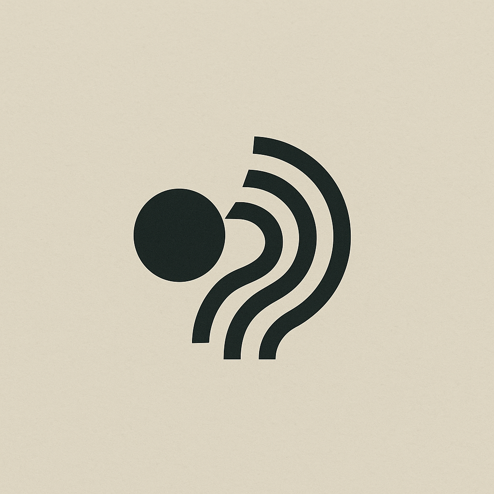

<div align="center">
  
</div>

# 🎵 Murmur

A beautiful, modern web interface for exploring and interacting with **Model Context Protocol (MCP)** servers. Built with Next.js 15, React 19, and TypeScript.


## ✨ Features

### 🌐 **MCP Server Connection**
- Connect to any MCP server via Server-Sent Events (SSE)
- Custom header support for authentication
- Real-time connection status monitoring
- Server information display (name, version, protocol version)

### 🛠️ **Tools Explorer**
- Browse available tools from connected MCP servers
- Interactive tool parameter configuration
- Real-time tool execution
- JSON-formatted response display

### 📦 **Resources Manager**
- List and explore server resources
- One-click resource reading
- Structured content display

### 💬 **Prompts Interface**
- Access server-provided prompts
- Dynamic parameter input
- Prompt execution with response viewing

### 🎨 **Beautiful UI**
- Modern, responsive design with Tailwind CSS
- Dark/light theme support
- Resizable panel layout
- Smooth animations and transitions
- Built with Radix UI primitives

## 🚀 Quick Start

### Prerequisites
- Node.js 18+ 
- npm, yarn, pnpm, or bun

### Installation

1. **Clone the repository**
   ```bash
   git clone <repository-url>
   cd murmur
   ```

2. **Install dependencies**
   ```bash
   npm install
   # or
   yarn install
   # or
   pnpm install
   ```

3. **Start the development server**
   ```bash
   npm run dev
   ```

4. **Open your browser**
   Navigate to [http://localhost:3000](http://localhost:3000)

## 🏗️ Architecture

### **Dual Client Architecture**
Murmur implements a sophisticated dual-client approach for maximum flexibility:

- **Browser Client** (`MCPClient`): Direct SSE connection for real-time communication
- **API Client** (`MCPAPIClient`): Proxied connections through Next.js API routes for enhanced security and connection management

### **Key Components**

```
src/
├── app/
│   ├── api/mcp/          # MCP API routes
│   │   ├── connect/      # Connection management
│   │   ├── tools/        # Tool operations
│   │   ├── resources/    # Resource operations
│   │   └── prompts/      # Prompt operations
│   └── page.tsx          # Main application
├── components/
│   ├── connection-form.tsx     # Server connection UI
│   ├── connection-modal.tsx    # Connection dialog
│   ├── tools-sidebar.tsx      # Tools/resources/prompts explorer
│   ├── request-response.tsx    # Execution interface
│   └── ui/                     # Reusable UI components
├── hooks/
│   └── use-mcp-connection.ts   # Connection state management
├── lib/
│   ├── mcp-client.ts          # Direct MCP client
│   ├── api-client.ts          # API proxy client
│   └── connections.ts         # Server-side connection store
└── types/
    └── mcp.ts                 # TypeScript definitions
```

### **State Management**
- React hooks pattern with centralized connection state
- Real-time updates via MCP protocol
- Persistent connection management across sessions

## 🔧 Development

### **Available Scripts**

| Command | Description |
|---------|-------------|
| `npm run dev` | Start development server with Turbopack |
| `npm run build` | Build for production |
| `npm start` | Start production server |
| `npm run lint` | Run ESLint |

### **Technology Stack**

- **Framework**: Next.js 15 with App Router
- **Runtime**: React 19 with TypeScript
- **Styling**: Tailwind CSS 4 with custom animations
- **UI Components**: Radix UI primitives
- **MCP Integration**: Official Model Context Protocol SDK
- **Icons**: Lucide React
- **Development**: Turbopack for fast refresh

## 🌟 Usage

### **Connecting to an MCP Server**

1. Click the **"Connect"** button in the header
2. Enter your MCP server's SSE endpoint URL (e.g., `http://localhost:3001/sse`)
3. Add any required headers (like authentication tokens)
4. Click **"Connect"** to establish the connection

### **Exploring Tools**

1. Once connected, browse available tools in the left sidebar
2. Click on any tool to view its schema and parameters
3. Fill in the required parameters in the right panel
4. Click **"Execute"** to run the tool and see results

### **Working with Resources**

1. Switch to the **"Resources"** tab in the sidebar
2. Browse available resources
3. Click on any resource to read its content
4. View the structured response in the main panel

### **Using Prompts**

1. Navigate to the **"Prompts"** tab
2. Select a prompt to view its template and parameters
3. Provide any required arguments
4. Execute the prompt to see the generated content

## 🤝 Contributing

We welcome contributions! Please feel free to submit issues and pull requests.

## 📄 License

This project is licensed under the MIT License - see the LICENSE file for details.

## 🔗 Related

- [Model Context Protocol](https://modelcontextprotocol.io/) - Official MCP documentation
- [MCP SDK](https://github.com/modelcontextprotocol/typescript-sdk) - TypeScript SDK for MCP
- [Next.js](https://nextjs.org/) - The React framework used
- [Tailwind CSS](https://tailwindcss.com/) - CSS framework

---

<div align="center">
  <strong>Built with ❤️ for the MCP community</strong>
</div>